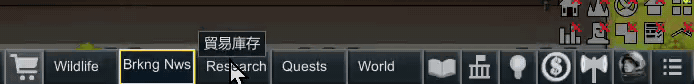
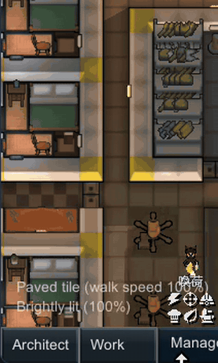
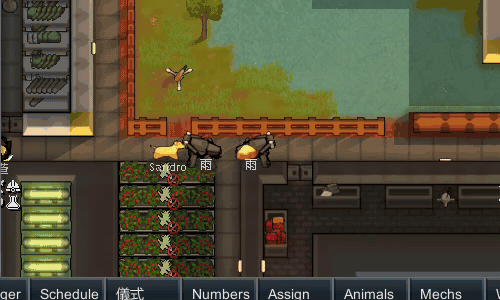

# Drag Reorder: Bottom Bar & Architect

RimWorld 1.6 mod. Reorder the bottom bar, the architect categories and the buildings inside each category by dragging them with the right mouse button.

Steam Workshop: https://steamcommunity.com/sharedfiles/filedetails/?id=3815397911

## How to use

Hold the right mouse button on a button, drag it onto another button and release. The dragged button takes that place. A plain right click (without moving the mouse) works exactly as before.

**Bottom bar**

**Architect categories**

**Buildings inside a category**

## Notes

- The order is kept in the mod settings and applies to every save. Each of the three orders can be reset there.
- Buttons that a mod adds later are placed next to where they would normally appear.
- Safe to add to or remove from an existing save.
- Do not use together with another mod that reorders the same buttons (for example Tab-sorting).

## Building

Requires Harmony. Source is in `Source/`; the built DLL goes to `1.6/Assemblies/`.
